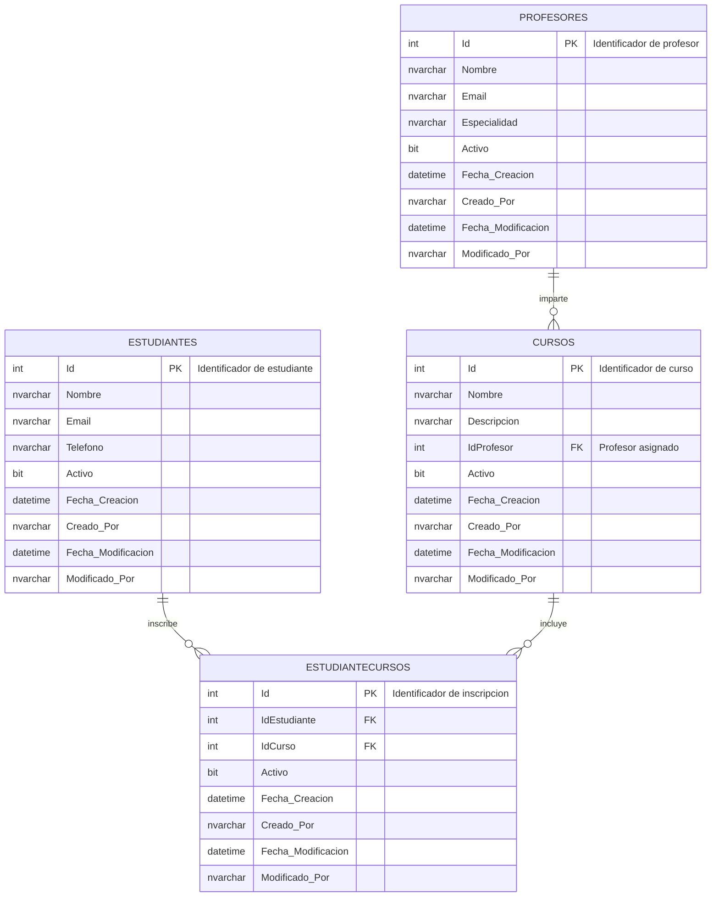

# Diagrama ER de EduDataAPI

```mermaid
erDiagram
    ESTUDIANTES {
        int Id PK "Identificador de estudiante"
        nvarchar Nombre
        nvarchar Email
        nvarchar Telefono
        bit Activo
        datetime Fecha_Creacion
        nvarchar Creado_Por
        datetime Fecha_Modificacion
        nvarchar Modificado_Por
    }

    PROFESORES {
        int Id PK "Identificador de profesor"
        nvarchar Nombre
        nvarchar Email
        nvarchar Especialidad
        bit Activo
        datetime Fecha_Creacion
        nvarchar Creado_Por
        datetime Fecha_Modificacion
        nvarchar Modificado_Por
    }

    CURSOS {
        int Id PK "Identificador de curso"
        nvarchar Nombre
        nvarchar Descripcion
        int IdProfesor FK "Profesor asignado"
        bit Activo
        datetime Fecha_Creacion
        nvarchar Creado_Por
        datetime Fecha_Modificacion
        nvarchar Modificado_Por
    }

    ESTUDIANTECURSOS {
        int Id PK "Identificador de inscripcion"
        int IdEstudiante FK
        int IdCurso FK
        bit Activo
        datetime Fecha_Creacion
        nvarchar Creado_Por
        datetime Fecha_Modificacion
        nvarchar Modificado_Por
    }

    PROFESORES ||--o{ CURSOS : imparte
    ESTUDIANTES ||--o{ ESTUDIANTECURSOS : inscribe
    CURSOS ||--o{ ESTUDIANTECURSOS : incluye
```
